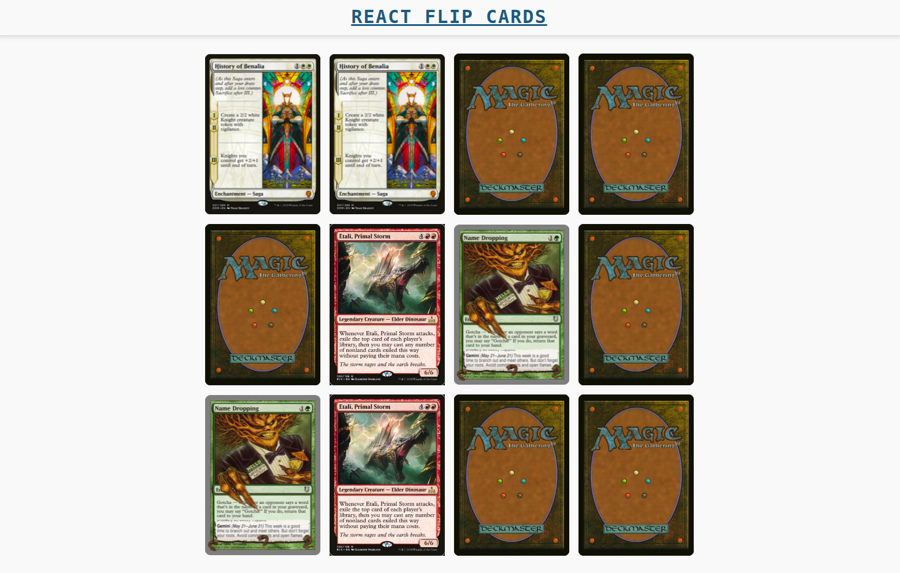

# React Memoria

Es un juego de memoria que le permite a un jugador voltear cartas y al completar el juego irá a una pantalla de celebración que le permitirá volver a jugar.

## UI



## Instalación

```bash
git clone git@github.com:omarefg/react-flip-cards.git
```

```bash
cd react-flip-cards
```

```bash
npm i
```

Abrir http://localhost:8080